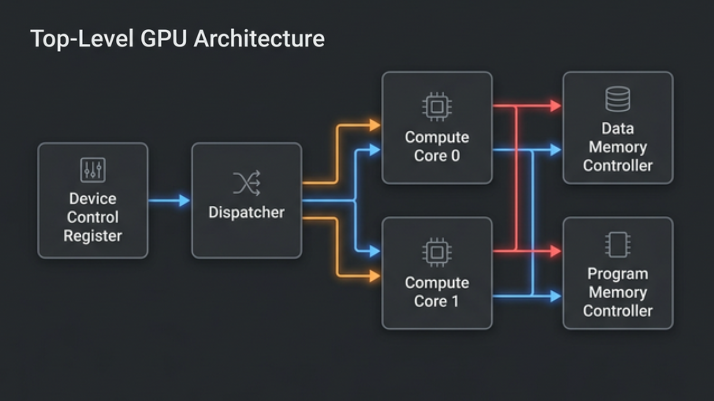
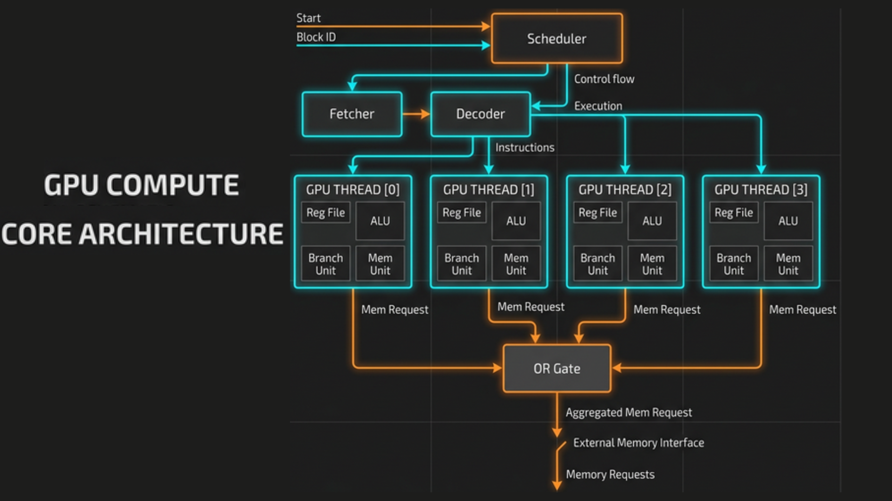
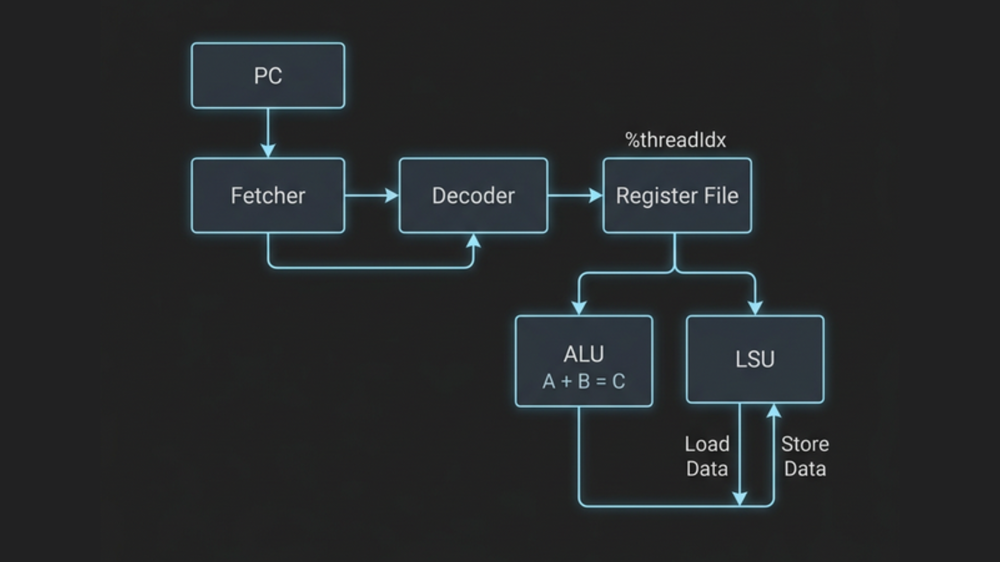
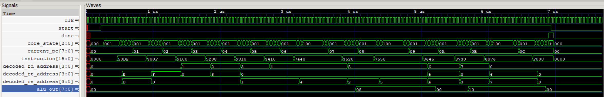

<h1 align="center">
   VectorCore
</h1>

<p align="center">
  <b>A Minimal Educational GPGPU in SystemVerilog</b><br>
  <i>made this to understand how GPUs work</i>
</p>

<p align="center">
  
  
  
</p>

---

**This repository is designed to help you understand the internal architecture and working principles of a GPU from the ground up.**

### Table of Contents

- [Overview](#overview)
- [Architecture](#architecture)
  - [GPU](#gpu)
  - [Memory](#memory)
  - [Core](#core)
- [ISA](#isa)
- [Execution](#execution)
- [Kernels](#kernels)
  - [Matrix Addition](#matrix-addition)
- [Simulation](#simulation)
- [Schematics](#schematics)
- [Advanced Functionality](#advanced-functionality)

---

# Overview


> [!MPORTANT]
> **VectorCore** is a minimal GPU implementation optimized for learning about how GPUs work from the ground up,
> rather than on the details of graphics-specific hardware.

This project is primarily focused on exploring:
1. **Architecture** - What does the architecture of a GPU look like? What are the most important elements?
2. **Parallelization** - How is the SIMD programming model implemented in hardware?
3. **Memory** - How does a GPU work around the constraints of limited memory bandwidth?

---

# Architecture

## GPU

`VectorCore` is built to execute a single kernel at a time. In order to launch a kernel, we need to:
1. Load global program memory with the kernel code
2. Load data memory with the necessary data
3. Specify the number of threads to launch in the device control register
4. Launch the kernel by setting the start signal to high.

<p align="center">
  
</p>

The GPU itself consists of the following units:
1. **Device Control Register**: Stores metadata specifying how kernels should be executed (the `thread_count`).
2. **Dispatcher**: Manages the distribution of threads to different compute cores by organizing them into groups called **blocks**.
3. **Compute Cores**: The actual processors (default is 2 cores).
4. **Memory Controllers**: Arbitrates access to data memory & program memory.

## Memory

The GPU is built to interface with an external global memory. Data memory and program memory are separated out for simplicity.

### Memory Controllers
Global memory has fixed read/write bandwidth, but there may be far more incoming requests across all cores to access data from memory than the external memory is actually able to handle.

The memory controllers keep track of all the outgoing requests to memory from the compute cores, throttle requests based on actual external memory bandwidth, and relay responses from external memory back to the proper resources.

## Core

Each core has a number of compute resources built around a certain number of threads it can support. In this simplified GPU, each core processes one **block** at a time, and for each thread in a block, the core has a dedicated ALU, LSU, PC, and register file. 

<p align="center">
  
</p>

### Scheduler
Each core has a single scheduler that manages the execution of threads. The `VectorCore` scheduler executes instructions for a single block to completion before picking up a new block, and it executes instructions for all threads in-sync and sequentially.

### Fetcher & Decoder
Asynchronously fetches the instruction at the current program counter from program memory, and decodes it into control signals for thread execution.

### Register Files
Each thread has its own dedicated set of register files, enabling the same-instruction multiple-data (SIMD) pattern. Crucially, each register file contains read-only registers holding data about the current block & thread being executed locally (`%blockIdx`, `%blockDim`, `%threadIdx`).

### ALUs & LSUs
- **ALU**: Dedicated arithmetic-logic unit for each thread to perform computations (`ADD`, `SUB`, `MUL`, `DIV`, `CMP`).
- **LSU**: Dedicated load-store unit for each thread to access global data memory (`LDR`, `STR`), handling async memory waits.

<p align="center">
  
</p>

---

# ISA

`VectorCore` implements a simple 11-instruction 16-bit ISA:

| Opcode | Instruction | Description |
|--------|------------|-------------|
| `0000` | `NOP`      | No operation |
| `0001` | `BRnzp`    | Branch if NZP condition matches |
| `0010` | `CMP`      | Compare two registers → sets NZP flags |
| `0011` | `ADD`      | `RD = RS + RT` |
| `0100` | `SUB`      | `RD = RS - RT` |
| `0101` | `MUL`      | `RD = RS × RT` |
| `0110` | `DIV`      | `RD = RS ÷ RT` |
| `0111` | `LDR`      | Load from memory |
| `1000` | `STR`      | Store to memory |
| `1001` | `CONST`    | Load immediate constant |
| `1111` | `RET`      | End thread execution |

Each register is specified by 4 bits (16 total registers). Registers `R0` - `R12` are free read/write registers. The last 3 registers are the special read-only SIMD registers: `%blockIdx`, `%blockDim`, and `%threadIdx`.

---

# Execution

Each core follows a 6-stage control flow to execute each instruction:
1. **FETCH** - Fetch the next instruction at current program counter.
2. **DECODE** - Decode the instruction into control signals.
3. **REQUEST** - Request data from global memory if necessary (if `LDR` or `STR`).
4. **WAIT** - Wait for data from global memory if applicable.
5. **EXECUTE** - Execute any computations on data.
6. **UPDATE** - Update register files and NZP register.

---

# Kernels

### Matrix Addition
This matrix addition kernel adds two 1 x 8 matrices by performing 8 element-wise additions in separate threads. It heavily utilizes the `%blockIdx`, `%blockDim`, and `%threadIdx` registers to demonstrate SIMD programming, along with `LDR` and `STR` for async memory management.

```asm
.threads 8
.data 0 1 2 3 4 5 6 7          ; matrix A (1 x 8)
.data 0 1 2 3 4 5 6 7          ; matrix B (1 x 8)

MUL R0, %blockIdx, %blockDim
ADD R0, R0, %threadIdx         ; i = blockIdx * blockDim + threadIdx

CONST R1, #0                   ; baseA (matrix A base address)
CONST R2, #8                   ; baseB (matrix B base address)
CONST R3, #16                  ; baseC (matrix C base address)

ADD R4, R1, R0                 ; addr(A[i]) = baseA + i
LDR R4, R4                     ; load A[i] from global memory

ADD R5, R2, R0                 ; addr(B[i]) = baseB + i
LDR R5, R5                     ; load B[i] from global memory

ADD R6, R4, R5                 ; C[i] = A[i] + B[i]

ADD R7, R3, R0                 ; addr(C[i]) = baseC + i
STR R7, R6                     ; store C[i] in global memory

RET                            ; end of kernel
```

---

# Simulation

`VectorCore` is built to simulate the execution of the kernels from the ground up using a standalone Icarus Verilog testbench!

### Prerequisites (Windows / Linux / macOS)
1. **sv2v** — SystemVerilog to Verilog converter ([Download](https://github.com/zachjs/sv2v))
2. **Icarus Verilog** (`iverilog`) — Verilog compiler ([Download](http://iverilog.icarus.com/))
3. **GTKWave** — Waveform viewer (optional, for viewing execution traces)

### Running the Matrix Addition Kernel (`C = A + B`)

```bash
# Compile and run the simulation!
make test_matadd

# Run the simulation AND automatically open the waveform viewer!
make wave_matadd
```

Executing the simulation will print a complete execution log directly to your console, and save a `docs/matadd_waveform.vcd` file.



```text
============================================================
  VectorCore: Matrix Addition Simulation
  C = A + B  where A = B = [0, 1, 2, 3, 4, 5, 6, 7]
  8 threads, 2 cores, 4 threads/block
============================================================

--- Initial Data Memory ---
Matrix A (addr 0-7):  0 1 2 3 4 5 6 7
Matrix B (addr 8-15): 0 1 2 3 4 5 6 7

>>> Launching kernel with 8 threads...

============================================================
  RESULTS (completed in 175 cycles)
============================================================

--- Final Data Memory ---
Matrix A (addr 0-7):   0 1 2 3 4 5 6 7
Matrix B (addr 8-15):  0 1 2 3 4 5 6 7
Matrix C (addr 16-23): 0 2 4 6 8 10 12 14
```


---

# Schematics

These animated schematics illustrate the operations and data pathways of the GPU and the individual Compute Cores.

### GPU Execution

<p align="center">
  
</p>

### Compute Core Execution

<p align="center">
  
</p>

---

# Advanced Functionality

For the sake of simplicity, there are many features implemented in modern GPUs to heavily improve performance that `VectorCore` omits:

- **Multi-layered Cache & Shared Memory**: Modern GPUs use multiple levels of SRAM cache and shared memory between thread blocks to avoid expensive global memory reads.
- **Memory Coalescing**: Combining neighboring memory requests into a single memory transaction to save addressing bandwidth.
- **Pipelining & Warp Scheduling**: Streaming execution of multiple instructions simultaneously, or hiding memory latency by swapping between different "warps" of threads.
- **Branch Divergence**: Handling situations where different threads in the same block evaluate an `IF` statement differently and must temporarily execute different instruction paths.


